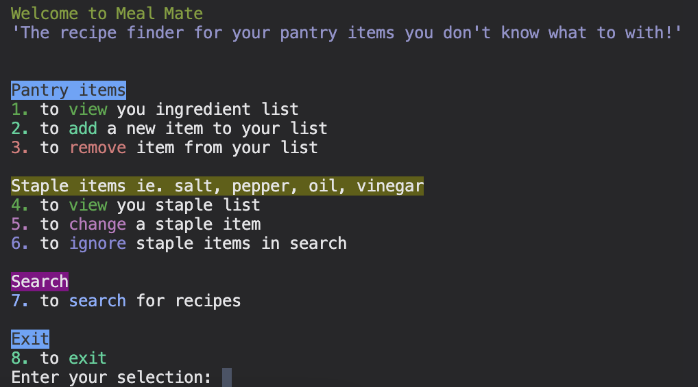

# T1A3 Python Terminal Application

## Links

---

[GitHub](https://github.com/tatermysalad/T1A3TerminalApp)
<br>

[Trello](https://trello.com/b/FUrubUml/t1a3terminalapp)
<br>

[Video Presentation](https://youtube.com)

## Style guide

---

[Python Style Guide - Python Enhancement Proposal 8](https://peps.python.org/pep-0008/)

## Meal Mate - Proposal

---

An recipe finding app for the command line inclined

Meal Mate provides an interface for a chef to create, read, update and remove items in their pantry. This is then used to search for recipes with the [Spoonacular API](https://spoonacular.com/food-api).

The list of ingredients are stored as CSV documents, with the staple items displayed with True/False values depending on availability - this can be manually edited to remove or add staples depending on the user.

The user can search for recipes with the list of ingredients needed under the recipe title. This can then be exported based on the HTML page from Spoonacular.

The target audience for this is anyone who cooks, specifically those who are interested in utilising specific/leftover ingredients.

## Meal Mate - App Features:

---

### Checklist of staple ingredients

Upon launching the application the staple ingredients are created based on a default list. For example, garlic, ginger, salt, pepper. This contains a True/False value on stock availability.

### Editable list of pantry ingredients

Upon launching the application the ingredients are created as a CSV. This is able to be edited within or outside of the application. Add, remove, view are options within. It will store the main ingredients, ie. protein, vegetables, etc.

### Fetch a list of recipes via API

The lists of ingredients and staples are used to search for recipes from an external source (Spoonacular). This contains the details of a wide range of cuisines which the user can select from based on name and number of ingredients.

### Export recipe from CLI to PDF.

The user can view a summary of the recipe within the application. Once the user is satisfied, they can select the recipe to export. This uses the HTML webpage to convert to PDF and saves to the directory of the user.

## Help documentation

---

### System/Hardware requirements:

-   Requires Python Version 3.10.x or later to be installed
-   Requires MacOS for full functionality
    -   Requires homebrew to install a dependency in the run.sh file
    -   Export feature will not work on Windows
-   Requires an internet connection
-   Tested working on MacOS 13.1.1

### Installation Instructions

1. Open a terminal window in your Macintosh computer
2. Navigate to the source (src) folder of the program
3. Run: (this will install the required modules and run the application)

```zsh
./init_run.sh
```

4. The application is now running.
5. Two '.csv' files which will be created on first run. These will be the location of staple and pantry ingredients. You can edit this either within the application or outside if preferred.

### Uninstall Instructions

1. Navigate to the source (src) folder of the program
2. Run: (this may require some user input)

```zsh
./uninstall.sh
```

3. The packages should now be uninstalled

### How to use

1. Run the application with the install file as above, or navigate to the src (source) folder in a terminal window, and run

```
python3 main.py
```

2. The main menu is navigated with numerical input, ie. entering the number 8 will exit the application.
   
3. Each heading has options below to view, add, and remove/ignore the lists.
4. Viewing the lists will present the overview of the Pantry items, or this will show the 'in stock' staple items.
   
5. After viewing you will need to press the 'Enter' key to return to the main menu.
6. To add a value to the ingredient list enter the name of the ingredient, make sure to spell this correctly.
7. To change a values availability enter its name as it is shown and the value with alternate between 'in stock' and 'out of stock'
   
8. To remove an ingredient enter the name as it is shown, similar to alternating a value in the staple items
9. To ignore the staple items in the search for recipes press number '6' from the main menu, then enter 'y' for yes and 'n' for no. The current option will be displayed after the entry.
10. To search for recipes with the options presented press number '7'. This will display 5 recipes ordered by the least amount of missing ingredients.
   
11. After this list you can view more details about a particular recipe, from index 1 to 5.
12. You can also export the option in a similar way. This export will be created in the source (src) folder.

## References

---

Find, install and publish python packages with the python package index PyPI. Available at: https://pypi.org/.

Python 3.11.3 documentation 3.11.3 Documentation. Available at: https://docs.python.org/.

Requests 2.29.0 documentation Quickstart . Available at: https://requests.readthedocs.io/en/latest/user/quickstart/#response-content.

W3Schools free online web tutorials W3Schools Online Web Tutorials. Available at: https://www.w3schools.com/.

Where developers learn, share, & build careers Stack Overflow. Available at: https://stackoverflow.com/.

The only food API you'll ever need. Spoonacular. Available at: https://spoonacular.com/food-api.
